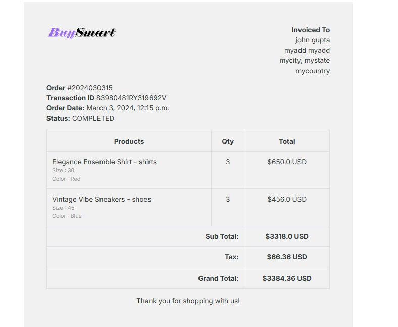
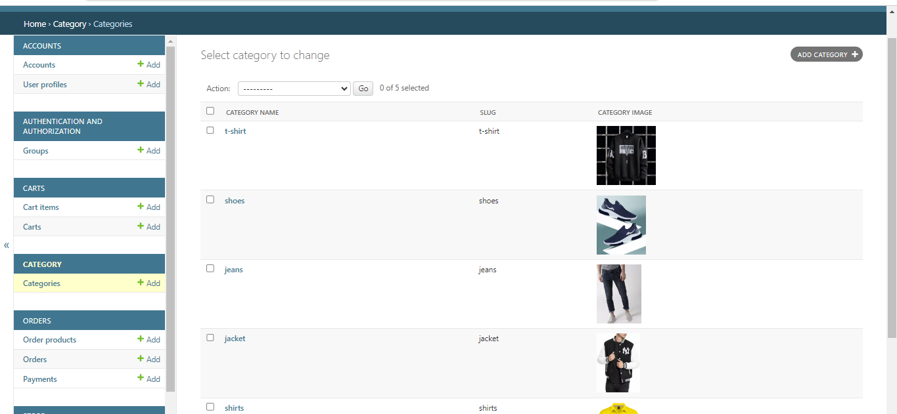

# BuySmart: A Django Web Application

## Overview

This project is a fully functional e-commerce platform developed using HTML, CSS, Bootstrap, JavaScript, and Django. It provides users with a responsive front-end design, email-based user authentication, payment processing with PayPal integration, dynamic product catalog pages, user reviews and ratings, a shopping cart, and an admin panel for efficient management of products, orders, and customer data.

## Demo
Check out the live demo: [buysmart](https://brijkishor.pythonanywhere.com/)

## Features

- **Responsive Design**: The application offers a responsive front-end design, ensuring an optimal viewing experience across various devices and screen sizes.

- **User Authentication**: Email-based user authentication is implemented to ensure secure user accounts. Users can register, login, and manage their profiles.

- **Payment Processing**: PayPal integration allows for seamless transaction processing, enabling users to make purchases securely.

- **Product Catalog**: The application features dynamic product catalog pages with filtering and sorting options, providing users with an enhanced browsing experience.

- **User Reviews and Ratings**: Users can leave reviews and ratings for products, enhancing user engagement and providing valuable feedback to other users.

- **Shopping Cart**: A shopping cart functionality is implemented, allowing users to add products, manage quantities, and proceed to checkout.

- **Admin Panel**: A robust admin panel is available for efficient management of products, orders, and customer data. Admin users have access to features such as product management, order management, and customer management.

## Technologies Used
- Django: Python web framework for backend development.
- Bootstrap: CSS framework for responsive and attractive front-end design.
- SQLite: Database management system for storing data.
- JavaScript: Enhances user experience with interactive features.
- HTML and CSS: Markup and styling of web pages.
- Font Awesome: Provides icons for a visually appealing interface.

## Getting Started
1. Clone the repository: `git clone <repository-url>`
2. Install dependencies: `pip install -r requirements.txt`
3. Run migrations: `python manage.py migrate`
4. Create a superuser: `python manage.py createsuperuser`
5. Start the development server: `python manage.py runserver`

## Usage

- **User Interface**: Users can browse products, add items to the cart, leave reviews and ratings, and complete purchases using the provided user interface.
  
- **Admin Panel**: Admin users can access the admin panel at `http://localhost:8000/admin` to manage products, orders, and customer data. Use the superuser account created during installation to login.

## screenshorts

### 1. Home Page

### 2. Product Catalog

### 5. Shopping Cart and Payment

### 6. Admin Panel

### 4. Dashboard and Authentication

<!-- ### 3. Product Details

### 6. Admin Panel

### 7. Payment Processing

### 8. Responsive Design

 -->

